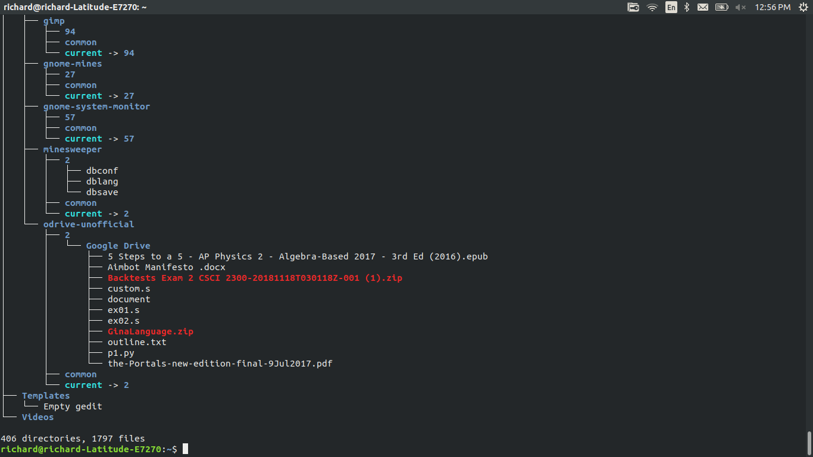
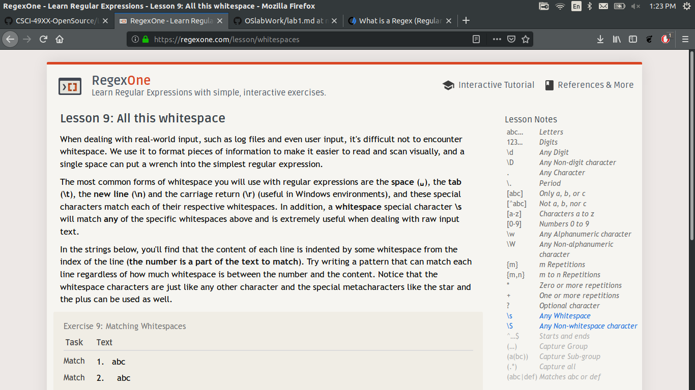

After this reading this article I realized the power of big companies in influencing the law and how they can easily mess with the lives of people for finacial gain. Putting my frustration with the justice system aside, I'll analyze the moral dilemma in the article. I think the lawsuit was clearly unjust. Jesse did not produce or promote copywrighted music, he just made the material easier to find by improving technology that already existed. The RIAA was pushing back against a new technology that would make their music easier to pirate, which would do damage to their profits. Before internet, music could not be spread as easily and the RIAA could reap maximum profit off of selling each copy. Jesse was being turned into an example for people in the future who wanted to do the same. He was vulnerable and could easily be targeted. Despite the efforts of the RIAA, this technology could obviously not be surpressed and the music industry would just have to deal with it. 

Screenshot of my tree

Problems done for regex 

9 regex probs done 

4 regex probs 
