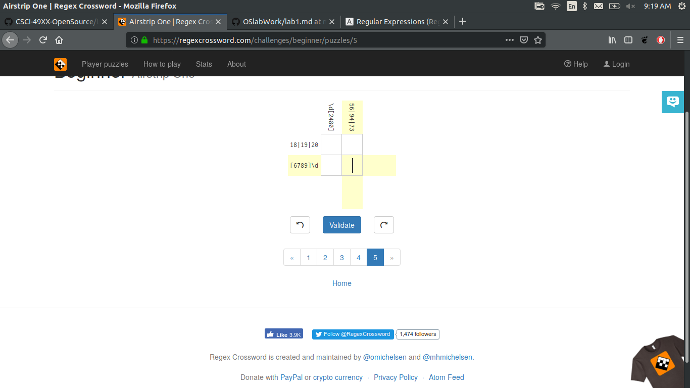

After this reading this article I realized the power of big companies in influencing the law and how they can easily mess with the lives of people for finacial gain. Putting my frustration with the justice system aside, I'll analyze the moral dilemma in the article. I think the lawsuit was clearly unjust. Jesse did not produce or promote copywrighted music, he just made the material easier to find by improving technology that already existed. The RIAA was pushing back against a new technology that would make their music easier to pirate, which would do damage to their profits. Before internet, music could not be spread as easily and the RIAA could reap maximum profit off of selling each copy. Jesse was being turned into an example for people in the future who wanted to do the same. He was vulnerable and could easily be targeted. Despite the efforts of the RIAA, this technology could obviously not be surpressed and the music industry would just have to deal with it. 

Screenshot of my tree

Problems done for regex 

9 regex probs done 

4 regex probs 

scratch prob 

I looked at this list of open source softwares provided in the lab file, and Audacity caught my eye. I've been using this software for years and never knew it was open source, now I want to consider making my own contributions to it. The architecture described how wxWidgets DLL is used for the user interface, which makes since because if you've ever used Audacity you know every thing is a widgit. It goes on to say that the end user GUI is functional, but the code behind it is horribly written, as GUI components essentially know specific information about things like left and right audio channels whereas that should be in the "application specific" code. I'll have to do more research, but it sounds like some of the code needs to be cleaned up because the application turns 20 this year and the GUI was duct-taped together along the way. 
